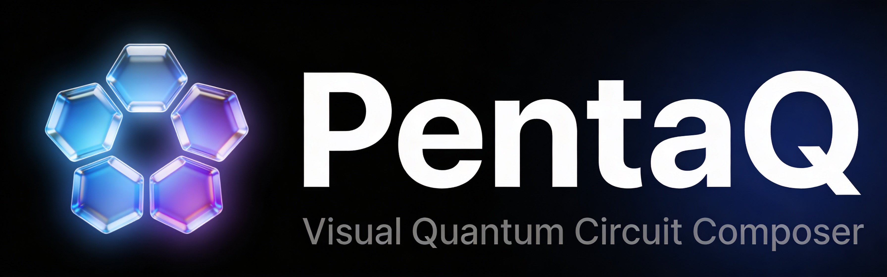

<div align="center">

<div align="center">
  
</div>

**Визуальный конструктор простых квантовых схем (до 5 кубитов)**

[](https://vitejs.dev/)
[](https://react.dev/)
[](https://www.typescriptlang.org/)
[]()
[]()
[](https://YuriySmirnovRepos.github.io/PentaQ)

🎯 **До 5 кубитов** &nbsp;|&nbsp; 🖱️ **Drag-and-drop** &nbsp;|&nbsp; 🔄 **Undo/Redo** &nbsp;|&nbsp; 🔗 **URL Sharing**

---

</div>

## 📸 Скриншоты

| Редактор схем |   Симуляция   |   Сфера Блоха    |
| :-----------: | :-----------: | :--------------: |
| _[Editor UI]_ | _[Histogram]_ | _[Bloch Sphere]_ |

---

## 🚀 Возможности

### 🧮 Квантовые гейты
```
Паули:     X, Y, Z
Адамар:    H
Фазовые:   S, T
Вращения:  Rx, Ry, Rz
Контроль:  CNOT, CZ, SWAP
```

### 🎨 Интерфейс
- ⚡ **Вычисления на клиенте**
- ↩️ **Undo/Redo**
- 🎭 **Темная/светлая тема**
- 📱 **Адаптивный дизайн**

### 🔬 Визуализация
- 📊 **Гистограмма** — вероятности измерений (Monte Carlo)
- 🔮 **Сфера Блоха** — 3D-визуализация состояния кубита

---

## 🛠️ Технологический стек

| Категория        | Технологии                            |
| ---------------- | ------------------------------------- |
| **Сборка**       | Vite 5 + SWC                          |
| **Фреймворк**    | React 18 (Strict Mode)                |
| **Язык**         | TypeScript (strict)                   |
| **Состояние**    | Zustand + Immer                       |
| **Симуляция**    | Нативная утилита расчета (Complex.js) |
| **Canvas**       | Konva.js (60 FPS)                     |
| **3D**           | React Three Fiber + Drei              |
| **Стили**        | Tailwind CSS 3.4                      |
| **UI**           | shadcn/ui + Radix                     |
| **Тестирование** | Vitest + Playwright                   |

---

## 📁 Архитектура (FSD)

```
📦 src/
├── 📂 app/              # Инициализация, роутинг, провайдеры
│   ├── pages/
│   ├── providers/
│   └── styles/
├── 📂 core/             # Бизнес-логика
│   ├── quantum/         # Типы, Circuit класс
│   └── simulation/      # Утилиты для расчета
├── 📂 features/         # Фичи
│   ├── circuit-editor/  # Canvas редактор
│   ├── gate-library/    # Палитра гейтов
│   ├── visualization/   # Bloch sphere, histogram
│   └── control-panel/   # Кнопки управления
└── 📂 shared/           # Переиспользуемые модули
    ├── ui/              # Button, Card, etc.
    └── lib/             # Утилиты, helpers
```

---

## ⚡ Быстрый старт

```bash
# 1. Клонирование
git clone https://github.com/YuriySmirnovRepos/PentaQ.git
cd PentaQ

# 2. Установка зависимостей
npm install

# 3. Запуск dev-сервера
npm run dev
# 🌐 Открыть http://localhost:5173
```

---

## 📋 Команды

| Команда              | Описание                 |
| -------------------- | ------------------------ |
| `npm run dev`        | 🚀 Dev server с HMR       |
| `npm run build`      | 📦 Production сборка      |
| `npm run preview`    | 👁️ Превью сборки          |
| `npm run test`       | 🧪 Unit тесты (Vitest)    |
| `npm run test:e2e`   | 🎭 E2E тесты (Playwright) |
| `npm run lint`       | 🔍 ESLint проверка        |
| `npm run type-check` | ✅ TypeScript проверка    |

---

## 📚 Документация

- [API Reference](./docs/api.md) — _в разработке_
- [Contributing Guide](./CONTRIBUTING.md) — _в разработке_
- [Roadmap](./ROADMAP.md) — _в разработке_

---

<div align="center">

## 📄 Лицензия

[](https://www.gnu.org/licenses/gpl-3.0)

**Made with 💜 to frontend & quantum computing**

</div>
